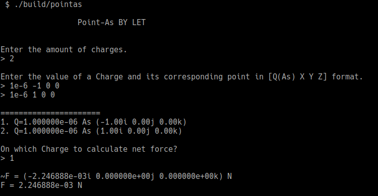
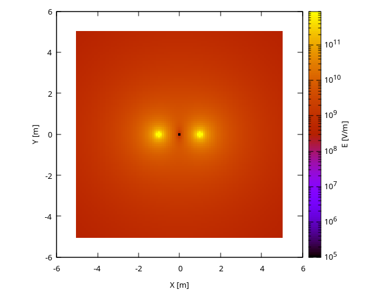

# Point-As

### A program that lets you calculate the net electric force on a point charge

It's nothing special. I made this program to check results of my hand calculations during my studies. It also outputs a TSV file for generating an E-field heatmap using Gnuplot.

To build it just run `make` inside the project's root folder.

## Screenshots

\
\
